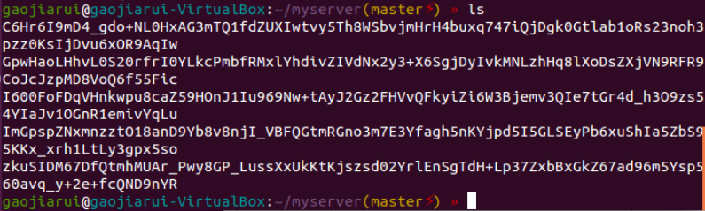
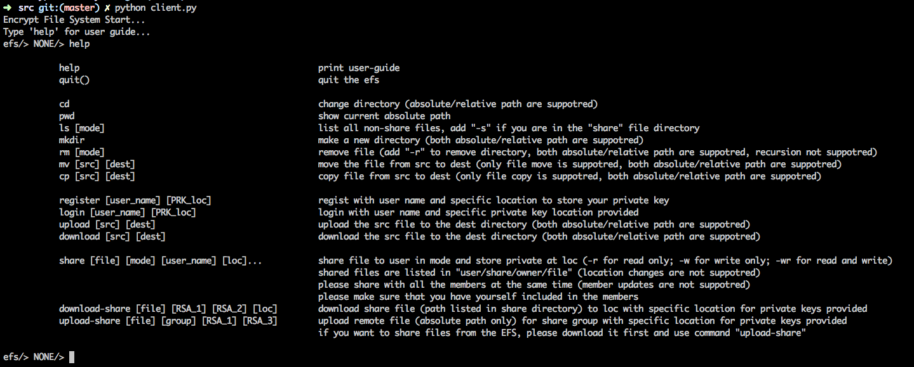

# 安全文件系统报告

高嘉蕊 14307130345

计算机科学与技术学院

## 系统设计

* 文件系统设计基本按照之前的设计方案，微小调整，具体设计方案见 report/plan_v3.pdf。
* 实现全部设计功能。

## 功能实现

* 用户对文件的基本上传、下载、重命名、移动等操作
* 支持类似 Linux 命令行的基本操作
* 文件区分读、写权限的建立分享组
* 文件加密、签名、验证
* 恶意用户行为时时记录
* 恶意文件服务器无法获取任何文件、文件目录等信息
* 恢复恶意文件服务器对文件的非法修改
* 支持多用户
* 恶意用户无法破坏文件系统，且即使破坏，无法获取关键信息

## 代码结构

* 运行 ./src/client.py 进行命令行交互
* ./src/file_system.py 用于执行文件操作
* ./src/encrypt.py 用于加密解密
* ./src/test_file_system.py 测试文件系统
* ./src/*.pem 为测试用户侧私钥
* ./src/file-system 为文件系统实际存储备份文件位置
* ./src/test-share 存储共享组私钥
* 修改 ./src/file_system.py 中 SSHPASS SERVER 等文件服务器信息，连接文件服务器

## 服务器端说明

上图展示服务器端界面。

* 根据设计方案说明，服务器端只相当于物理存储，没有文件目录，全部扁平化存储。
* 图中名字均为加密之后的文件名。保证服务器无法获取任何文件目录或组织结构信息。

## 文件系统说明

上图展示文件服务器界面。

具体命令操作根据 help 提示进行操作即可。

* 实现中尽可能避免文件系统因为出错崩溃，同时因为公钥、共享等信息均保存在文件中，即使文件系统崩溃仍然保证不会丢失信息。
* 通过命令路径检查，保证用户之间完全隔离；同时文件系统中仅存储公钥以及加密的备份文件，即使恶意用户入侵也无法获取关键信息。
* 每次上传文件之前用户对文件计算哈希值并签名，下载文件验证并计算哈希值，保证任何非法修改被检测到；同时上传本地加密备份文件的操作，保证文件非法修改可被恢复。
* 对文件的重命名、移动、删除等操作会同步修改文件服务器上的存储信息，保证文件服务器上没有冗余文件。

## 文件共享说明

* 文件系统中通过 share 命令建立新的共享组，通过 upload-share 与 download-share 命令在已有共享组上传或下载文件。
* 每次操作均会对用户权限与文件签名等进行验证。
* 共享权限完全根据密钥控制，具体私钥授予当时见 plan_v3.pdf。

## 文件系统功能局限性

* 对部分文件目录操作，如移动等操作没有实现。
* 共享文件移动没有实现，目前不允许用户将共享文件存储与其他文件混合。
* 共享组成员与权限固定之后不支持修改。
* 可能很多边界输入没有考虑到。

